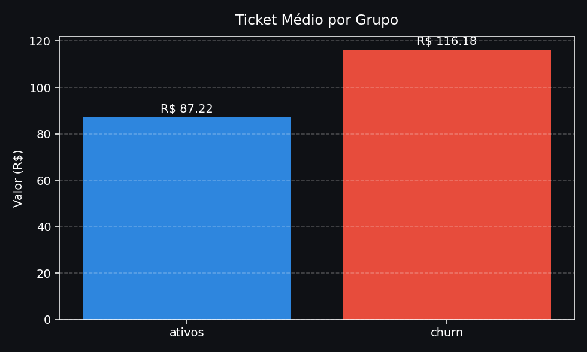
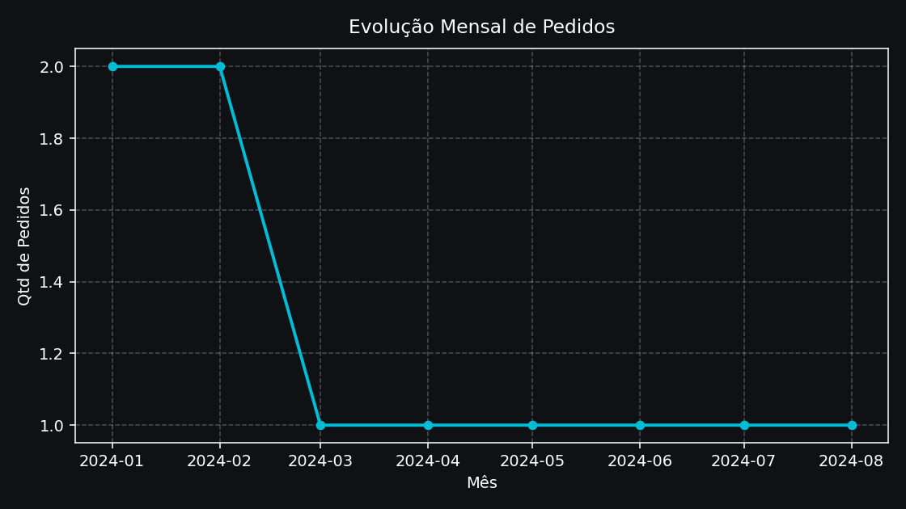

# 📊 Análise de Churn de Clientes

Este projeto tem como objetivo analisar a **taxa de churn (cancelamento/inatividade de clientes)** a partir de uma base fictícia de pedidos.  
Além do cálculo dos indicadores, o projeto também gera **gráficos automatizados** com Python (pandas + matplotlib), salvando os resultados em CSV e PNG.

---

## 🎯 Objetivo do Projeto
- Calcular a **taxa de churn** (clientes que não compraram nos últimos 90 dias).  
- Comparar o **ticket médio** de clientes ativos x inativos.  
- Gerar relatórios em CSV com os indicadores.  
- Criar **visualizações gráficas** (pizza, barras, linha) para facilitar a interpretação.  

---

## 🛠️ Tecnologias Utilizadas
- **Python 3**
- **Pandas** → tratamento e análise de dados  
- **Matplotlib** → visualização de dados  
- **CSV** → entrada e saída de dados  

---

## 📂 Estrutura do Projeto
analise_churn/
│
├── churn.csv # Base de dados fictícia
├── script.py # Script principal de análise
│
├── resultados/ # Resultados em CSV
│ ├── churn_rate.csv
│ ├── clientes_inativos.csv
│ └── ticket_churn.csv
│
└── graficos/ # Visualizações geradas
├── churn_pizza.png
├── ticket_barras.png
└── pedidos_linha_mensal.png

---

## 🔄 Uso dos Resultados

Além de visualizar diretamente no Python, os arquivos salvos em **`resultados/`** podem ser reutilizados para:

- **Dashboards no Power BI ou Tableau**: basta importar os CSVs.  
- **Excel**: abrir e montar gráficos dinâmicos.  

Dessa forma, o projeto já simula um **pipeline de ETL simples**:
1. **Extração** → leitura da base `churn.csv`  
2. **Transformação** → cálculos de churn, ticket médio, filtragem  
3. **Load** → salvando resultados em CSVs para consumo em outras camadas (gráficos, BI, relatórios)

---

## 📊 Resultados Obtidos

- **Data de referência**: 2024-08-01  
- **Taxa de churn**: **60%**  
- **Ticket médio (ativos)**: R$ 87,22  
- **Ticket médio (churn)**: R$ 116,18  

📌 *Insight*: Os clientes que deixaram de 
comprar (**churn**) tinham um **ticket médio maior**
do que os clientes ativos, indicando 
uma perda significativa para o negócio.

---

## 📈 Visualizações

### Distribuição de Clientes (Ativos x Churn)
.

### Ticket Médio por Grupo

### Evolução Mensal de Pedidos

---

## 🚀 Conclusão
Este projeto mostra como identificar e medir o **churn de clientes** de forma simples e eficiente, além de comparar o impacto financeiro entre clientes ativos e inativos.  

Esse tipo de análise é essencial para empresas que buscam:  
- Melhorar a **retenção de clientes**  
- Entender a **perda de receita** com churn  
- Criar **estratégias de fidelização**

---

✍️ Desenvolvido por *Nicoly Cardoso dos Santos Rocha*  
